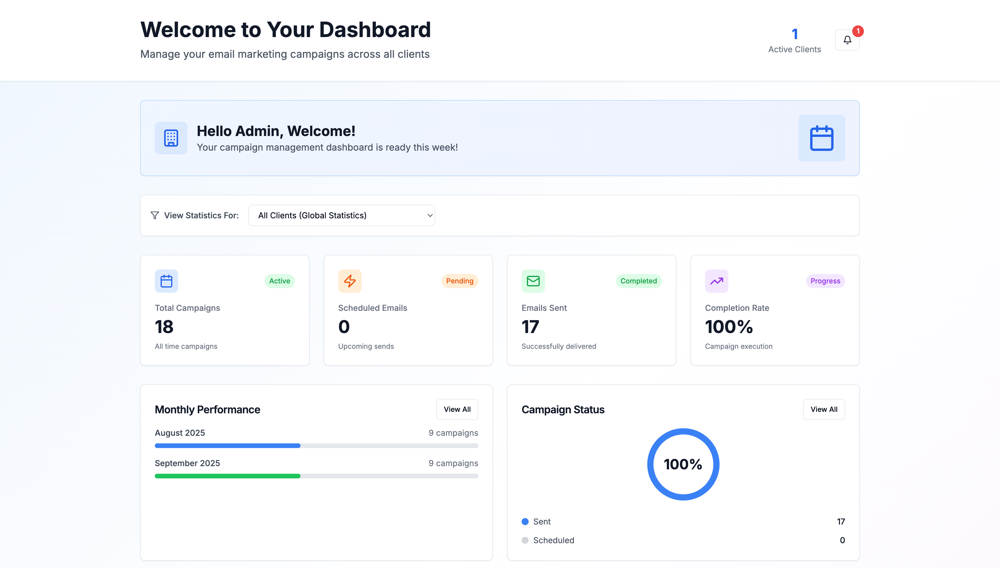

# Email Marketing Calendar Dashboard

  <!-- Two images side by side -->
  <table>
    <tr>
      <td></td>
      
    </tr>
  </table>

## 📖 Overview
A modern multi client email marketing calendar with visual flow automation. Agencies use it to plan campaigns, show clients their schedules, and present automation sequences with a clean calendar and a simple access model.

---

## ⚡ Highlights
- 🗓️ Visual calendar for campaign planning and scheduling
- 🔁 Flow builder with triggers, delays, and email content
- 🧩 Multi client support with branded calendars and portals
- 🔐 Client access control with PIN and client specific links
- 📈 Real time stats with campaign performance and analytics
- 🛠️ Admin controls for clients, campaigns, flows, and reports
- 🔑 **APIs Used:** Neon PostgreSQL, Google Cloud Storage (via Replit Sidecar), Replit Platform

---

## 🏗 System Features
- 🖥️ **Dashboard** – plan campaigns, manage flows, check performance
- 📅 **Calendar** – drag and drop scheduling, color coded campaign types
- 🔄 **Automation** – trigger based sequences with editable delays and content
- 👤 **Client Portals** – branded, read only views with notes and comments
- 🛡️ **Access** – session based auth with PIN protection and lockout
- 📊 **Analytics** – campaign metrics, summaries, and export ready views
- 🧭 **Admin Panel** – manage clients, branding, campaigns, and flows

---

[🔙 Back to Portfolio](../README.md)

