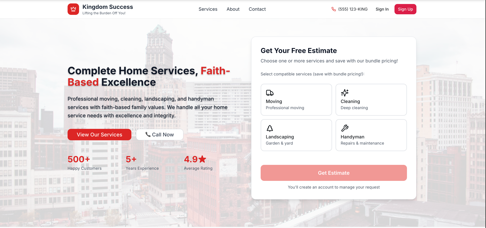
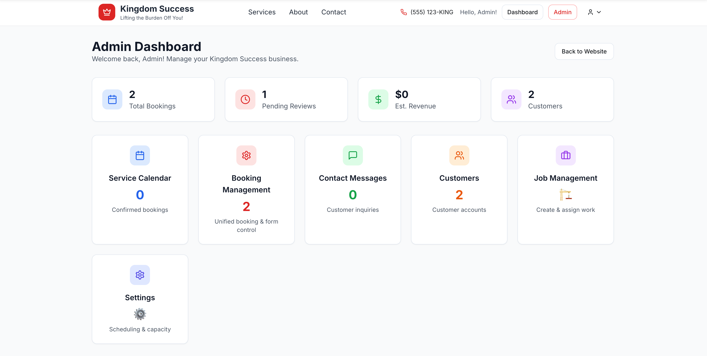

# Kingdom Success Inc – Project Documentation

  <!-- Two images side by side -->
  <table>
    <tr>
      <td></td>
      <td></td>
    </tr>
  </table>

## 📖 Overview
Kingdom Success Inc is a faith based home services platform offering moving, cleaning, landscaping, and handyman services. The application includes a complete booking system, user authentication, payment processing, admin management, and service specific workflows.

---

## ⚡ Highlights
- 📦 Multi service booking system with detailed forms  
- 👥 Role based authentication for customers, admins, and workers  
- 💳 Stripe integration with deposit + final payment flow  
- 📊 Admin dashboard for booking management and analytics  
- 🖥️ Service specific forms for moving, cleaning, landscaping, and handyman requests  
- 🔑 **APIs Used:** Neon PostgreSQL, Stripe, Replit Platform  

---

## 🏗 System Features
- 🖥️ **Booking System** – supports multiple services with status tracking  
- 👤 **User Management** – secure login, profiles, and booking history  
- 🛠️ **Admin Interface** – manage bookings, customers, and contacts  
- 💳 **Payments** – deposit and final payments with Stripe workflow  
- 📄 **Service Forms** – tailored forms for moving, cleaning, landscaping, and handyman jobs  
- 📊 **Analytics** – real time booking stats and admin reports  

---

[🔙 Back to Portfolio](../README.md)
