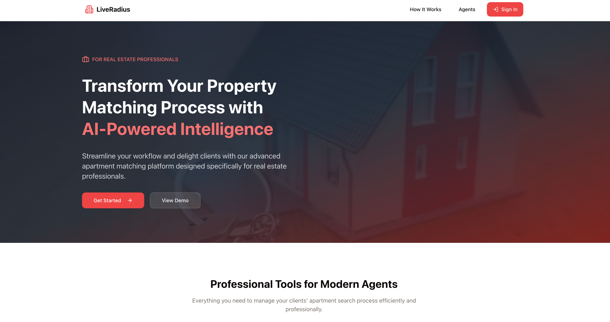

  <!-- Two images side by side -->
  <table>
    <tr>
      <td></td>
      <td></td>
    </tr>
  </table>

# LiveRadius – Intelligent Apartment Discovery Platform

## 📖 Overview
LiveRadius is an apartment discovery platform that goes beyond price and size. It uses AI powered lifestyle matching to connect users with apartments based on their daily routines, commute preferences, and proximity to important locations like work, gyms, or grocery stores.

---

## ⚡ Highlights
- 🏙️ Lifestyle first approach – minimize travel to work, gym, stores, and more  
- 🤖 AI matching – personalized compatibility scores and explanations  
- 📡 Real time data – integrates Google Maps with live rental listings  
- 📊 Transparent scoring – weighted distances + AI insights for each match  
- 🗂️ Saved preferences – users set categories and priorities for recommendations  
- 🔑 **APIs Used:** Google Maps, RentCast, OpenAI  

---

## 🏗 System Features
- 🖥️ **Dashboard** – manage lifestyle preferences and run searches  
- 🏡 **Apartment Matching** – combines RentCast listings with Google Maps data  
- 🤖 **AI Analysis** – OpenAI GPT-4 generates scores and explanations  
- 📊 **Results Page** – detailed rankings, favorites, and compatibility breakdowns  
- 🔐 **Authentication** – secure session management with Passport.js  
- 🛠️ **Admin Tools** – agent profiles, client assignments, and reporting  

---

[🔙 Back to Portfolio](../README.md)
