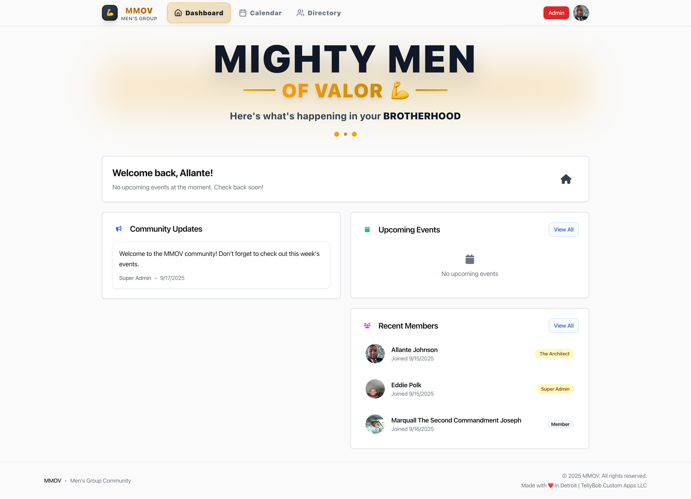

# MMOV – Men's Group Management App

  

## 📖 Overview
MMOV is a private members-only application designed for men's groups. The app provides a secure platform where members can create accounts, complete required profiles, and access shared calendars and directories. A three-tier role-based system (Member, Admin, Super Admin) ensures that permissions and features are properly controlled.

---

## ⚡ Tech Highlights
- 🚀 Built with **React + Vite + TypeScript** (frontend)  
- 🗄️ **Node.js + Express + PostgreSQL** backend with Drizzle ORM  
- 🔑 **Replit OIDC authentication** with secure session handling  
- 🔒 **Role-based access control (RBAC)**: Member, Admin, Super Admin  
- 📂 **Google Cloud Storage integration** for profile images & file uploads  
- ✅ **Validation pipeline** using Zod + React Hook Form  
- ⚙️ **Database migrations** with Drizzle Kit  
- 🎯 Designed for secure, production-ready internal SaaS apps  

---

## 🏗 System Architecture
### Frontend
- **Framework:** React with TypeScript + Vite
- **Routing:** Wouter (role-based navigation)
- **UI:** Shadcn/UI + Tailwind CSS
- **State Management:** TanStack React Query
- **Forms:** React Hook Form + Zod
- **File Uploads:** Custom ObjectUploader → Google Cloud Storage

### Backend
- **Runtime:** Node.js + Express.js (TypeScript, ES modules)
- **Database:** PostgreSQL via Drizzle ORM
- **Sessions:** Express sessions stored in PostgreSQL
- **Storage:** Google Cloud Storage for profile images and files
- **API:** RESTful endpoints with authentication middleware

### Authentication & Authorization
- **Identity Provider:** Replit OIDC
- **Sessions:** PostgreSQL-backed secure cookies
- **Roles:** Member, Admin, Super Admin
- **Profile Gating:** Users must complete profiles before gaining full access

---
