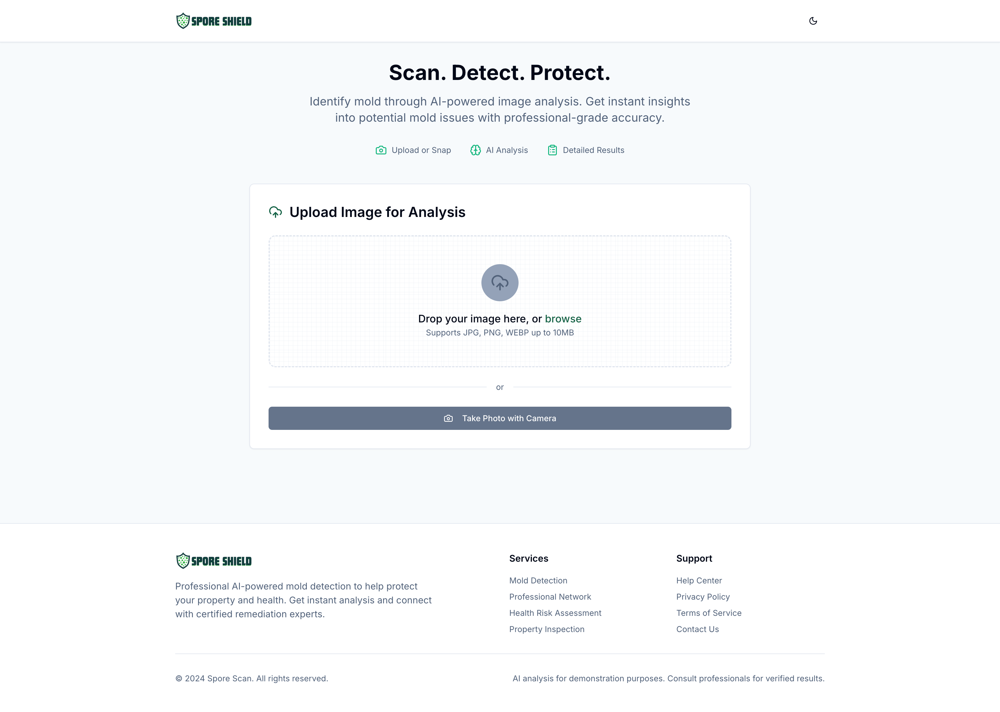

  

# Spore Scan – AI Mold Detection App

## 📖 Overview
Spore Scan is a web application that uses AI-powered image analysis to detect and identify mold in photos. Users can upload or capture images, receive instant AI analysis with detailed results (mold type, confidence levels, health risks, and remediation recommendations), and connect directly with professional remediation services through a built-in contact form.

---

## ⚡ Highlights
- 📸 Upload or capture photos of potential mold  
- 🤖 AI analysis with mold type, confidence scores, and health risk details  
- 📝 Instant recommendations for remediation  
- 📨 Integrated contact form to reach remediation professionals  
- 📊 Real-time API status monitoring (AI, email, database)  
- 🔑 Powered by **OpenAI**, **Resend**, and **Neon PostgreSQL**  
- 📂 Database-backed history of analyses and user submissions  

---

## 🏗 System Features
- 🖥️ **Dashboard** – central hub for uploading images and viewing results  
- 📊 **Analysis Reports** – detailed AI-powered breakdown of mold detection  
- 📅 **API Status Monitor** – live check of OpenAI, Resend, and database health  
- 📨 **Contact System** – integrated form connecting users with remediation professionals  
- ⚙️ **Planned Authentication** – future session-based login and role management  

---

[🔙 Back to Portfolio](../README.md)
