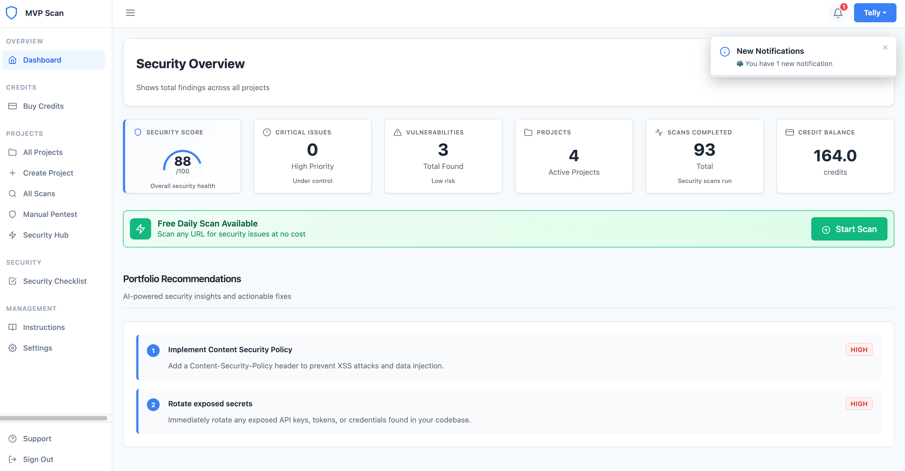

# VibeCheck Security Scanner – Project Documentation

  

## 📖 Overview
VibeCheck Security Scanner is a production-ready security scanning platform that analyzes web applications and GitHub repositories for vulnerabilities, exposed secrets, and misconfigurations. It delivers AI-powered scorecard reports with risk levels, remediation guidance, and historical progress tracking.

---

## ⚡ Highlights
- 🔍 Scans web apps & GitHub repositories for vulnerabilities and secrets  
- 📊 AI-powered **Scorecard Reporting** with risk levels & trend tracking  
- 🔑 GitHub OAuth integration for private repo scanning  
- 💳 Built-in credit system with subscription billing (Lemon Squeezy)  
- 🛡️ Integrated security tools: Gitleaks, TruffleHog, Nuclei, Syft, Grype  
- 👩‍💻 Admin portal for transaction and user management  
- 🔑 **APIs Used:** OpenAI, Anthropic Claude, GitHub API, Supabase, Lemon Squeezy  

---

## 🏗 System Features
- 🖥️ **Dashboard** – manage scans, view results, and track projects  
- 🔐 **GitHub Integration** – OAuth for repo access, commit analysis, secret detection  
- 📊 **Scorecard System** – 7 security categories with AI-powered analysis & CVSS scoring  
- 💳 **Credit Wallet** – pay-per-scan model with bulk packages & free daily scans  
- 🛠️ **Security Engine** – combines Gitleaks, TruffleHog, Nuclei, Syft, and Grype  
- 👩‍💼 **Admin Portal** – manage credits, transactions, and user accounts  
- 📈 **Trend Tracking** – compare historical scorecards and monitor improvements  

---

[🔙 Back to Portfolio](../README.md)

